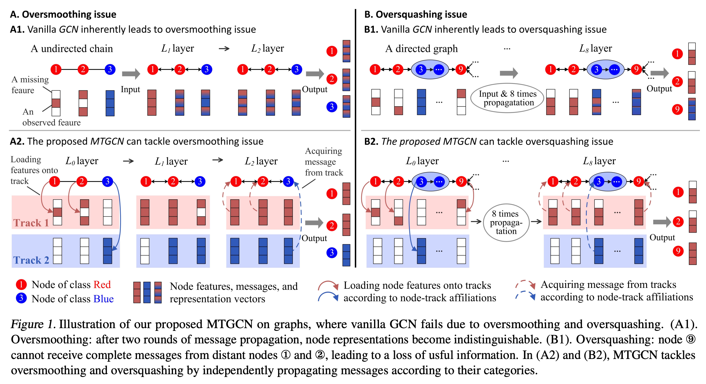

# MTGCN: Multi-Track Graph Convolutional Network

Code and models for the paper ["Multi-Track Message Passing: Tackling Oversmoothing and Oversquashing in Graph Learning via Preventing Heterophily Mixing"](https://openreview.net/pdf?id=1sRuv4cnuZ)



MTGCN is a novel architecture designed to address the oversmoothing and oversquashing issues in graph learning. It operates based on the principle of **preventing heterophily mixing** during message passing.

## Key Concepts

**Message Tracks**: These are isomorphic graphs sharing the same topology as the original graph. Each track is dedicated to handling messages of a specific category semantic, ensuring that messages are separated based on their semantic categories.

## Working Process

1. **Loading Step**: The raw features of all nodes are loaded onto corresponding tracks as initial messages. This is guided by the node-track affiliation matrix . Nodes belonging to the same category are associated with the same track, which helps in organizing the message flow from the start.
2. **Multi-Track Message Passing (MTMP)**: In this crucial step, the initial messages are updated through propagation and aggregation within their respective tracks. At each layer, messages in different tracks are independently processed. This mechanism brings several benefits:

   * **Preventing Heterophily Mixing**: By only allowing interactions between nodes of the same category when the node-track affiliation matrix  is accurate, it maintains the semantic purity of the messages and node representations.
   * **Facilitating Long-Distant Information Flow**: It decouples messages from node representations during the message passing process. This enables messages to pass through nodes without being blocked, facilitating the flow of long-distant information and helping in learning long-range dependencies.
   * **Enhancing Separation Condition**: From the perspective of semi-supervised learning, it improves the separation condition. By reducing the proportion of nodes that exchange messages with neighbors of different categories, it theoretically lowers the error bound of the model.
3. **Acquiring Step**: Based on the affiliations , nodes gather the updated messages from their affiliated tracks to construct their final node representations.

## Dependency

You can directly run

```bash
bash build_env.sh
```

to build the environment. If your CUDA version is too low, please modify the download path of the whl file and downgrade the CUDA version.

## Dataset Preparation

Step 1: Open your terminal and execute the following command:

```bash
cd data
```

Step 2: You need to download the corresponding dataset. For detailed instructions, please refer to [PyG](https://pytorch-geometric.readthedocs.io/en/latest/modules/datasets.html).

Step 3. After downloading the dataset, in order to reproduce the results in Table 3 of the paper, we need an additional data split. Please run the following command:

```
python data_process.py
```

Please ensure that you have completed each step carefully to set up the dataset properly for further use. For the convenience of reproduction, we also provide the data splits. You can find them in the directory `data/new_splits`.  The structure of the `data` folder should be as follows.

```
├── citeseer
│   ├── processed
│   └── raw
......
├── new_splits
....
├── texas
│   ├── processed
│   └── raw
```

## Training MTGCN

The `args.py` file contains all the running configurations. For the semi-supervised node classification task, you need to set the `new_split` parameter to `False` For the fully-supervised node classification task, please set it to `True`.

For example, you can run the following commands to reproduce the experimental results of Table 1.

```
cd MTGCNv3
python mutil_stage_train.py --dataset='cora' --lr=0.027920509858814585 --tblr=0.04058690216962289 --tbwd=2.251707502590961e-05 --tpwd=9.461065633432985e-05 --lw=0.4523908455284135 --dr=0.7228747203954067 --layer_num=16 --new_split=False
```

The optimal hyperparameters can be searched by Optuna. You just need to execute the following command.

```
cd MTGCNv3
python optuna_search.py --dataset=[data_name] --new_split=[False/True]
```

For the convenience of reproduction, we provide some specific results of hyperparameter search in the `MTGCNv3/optuna_res`folder. In the future, we will upload all the running results and model checkpoints.

## References

If you find the code useful for your research, please consider citing

```
@inproceedings{peimulti,
  title={Multi-Track Message Passing: Tackling Oversmoothing and Oversquashing in Graph Learning via Preventing Heterophily Mixing},
  author={Pei, Hongbin and Li, Yu and Deng, Huiqi and Hai, Jingxin and Wang, Pinghui and Ma, Jie and Tao, Jing and Xiong, Yuheng and Guan, Xiaohong},
  booktitle={Forty-first International Conference on Machine Learning}
}
```
